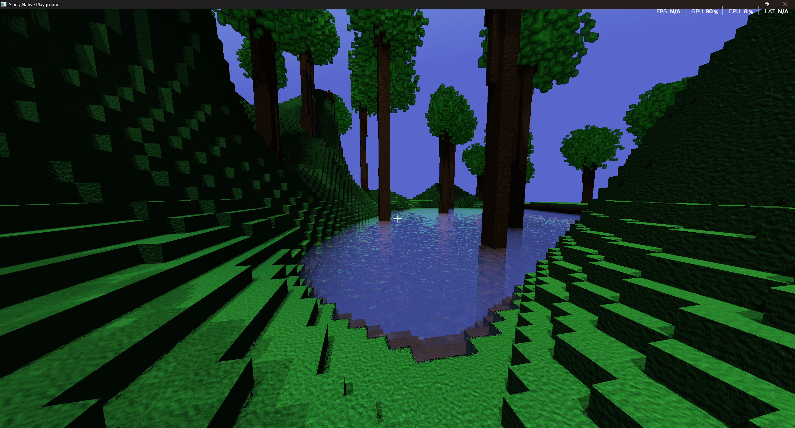

# Slang Voxels

This is a simple example of using [slang-native-playground](https://github.com/Devon7925/slang-native-playground). See that repo for more information. The voxel engine for this originally comes from my [voxel-game project](https://github.com/Devon7925/voxel-game).

## Running

This app can be run by cloning the repository and then executing `cargo run` from the root folder. 

## Web Build

This app supports building for web. To do so run:

```bat
cargo build --target wasm32-unknown-unknown
wasm-bindgen --out-dir target/generated/ --web target/wasm32-unknown-unknown/debug/slang-voxels.wasm 
```

The web build should then be accessible from `index.html`. To see the current web deploy see the [Github Pages Deploy](https://devon7925.github.io/slang-voxels/).



## Missing things compared to original

* Healthbar
* Cooldown display
* Cooldown implementation
* Projectiles
* Player rendering
* Multiplayer
* Game modes
* GUI notifications
* fullscreen_toggle doesn't work
